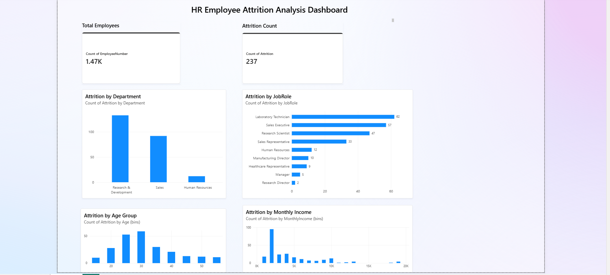
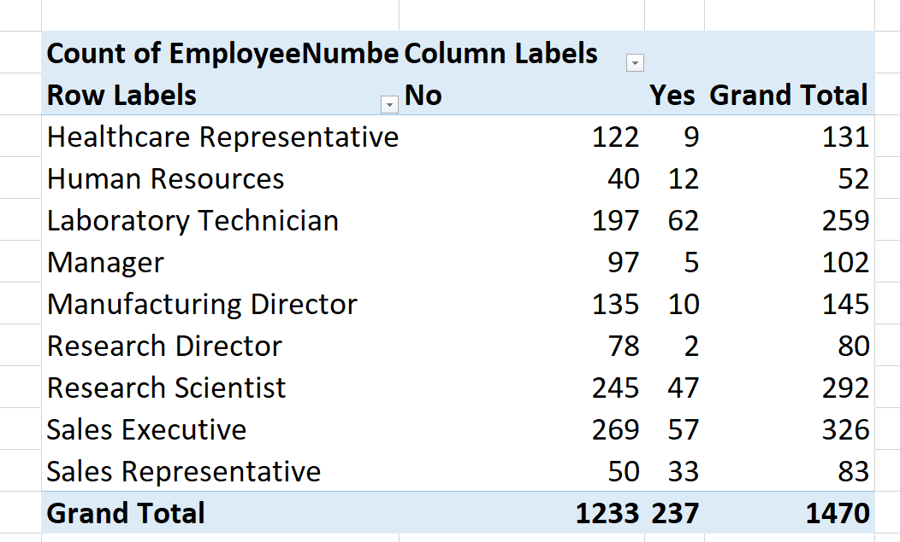
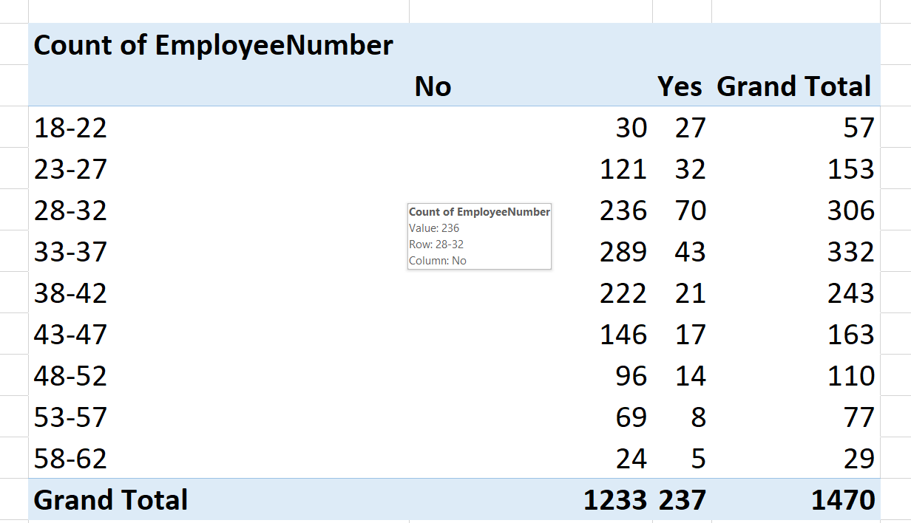

# HR Employee Attrition Analysis

## Project Overview

This project focuses on analyzing employee attrition to understand the patterns behind employee turnover.

I worked with an HR dataset of **1,470 employee records** and used **Excel and Power BI** to explore the data, summarize employee information, and present the findings through visualizations and an interactive dashboard.

## Dashboard Preview

## Excel Analysis

### Attrition by Job Role

### Attrition by Age Group

## What I Worked On

* Explored and prepared the HR dataset for analysis
* Created Pivot Tables in Excel to summarize employee attrition
* Compared attrition across departments and job roles
* Analyzed attrition across different age groups
* Examined monthly income ranges and their relationship with attrition
* Built a Power BI dashboard to present the analysis visually

## Tools

**Excel**
Pivot Tables, data analysis and summarization

**Power BI**
Dashboard development, visualizations and interactive analysis

## Dataset

The dataset contains **1,470 employee records** with information related to employee demographics, job details, income and attrition status.

## Key Areas Analyzed

* Overall Attrition
* Department-wise Attrition
* Job Role-wise Attrition
* Age Group-wise Attrition
* Monthly Income-wise Attrition

## Project Outcome

The analysis provides a clearer understanding of the employee groups and job areas where attrition patterns can be observed. These findings can help HR teams investigate potential retention challenges and make more informed workforce decisions.

## Skills Demonstrated

* Microsoft Excel
* Pivot Tables
* Power BI
* Data Analysis
* Data Visualization
* Exploratory Data Analysis
* Business Insights

## Project Files

* **Excel Workbook** – HR data analysis and Pivot Tables
* **Power BI File** – Interactive dashboard and visual analysis

## About Me

**Nissi Janga**
B.Tech in Computer Science and Engineering | Aspiring Data Analyst

I am developing my data analytics skills through practical projects using Excel, Power BI and other data analysis tools.
